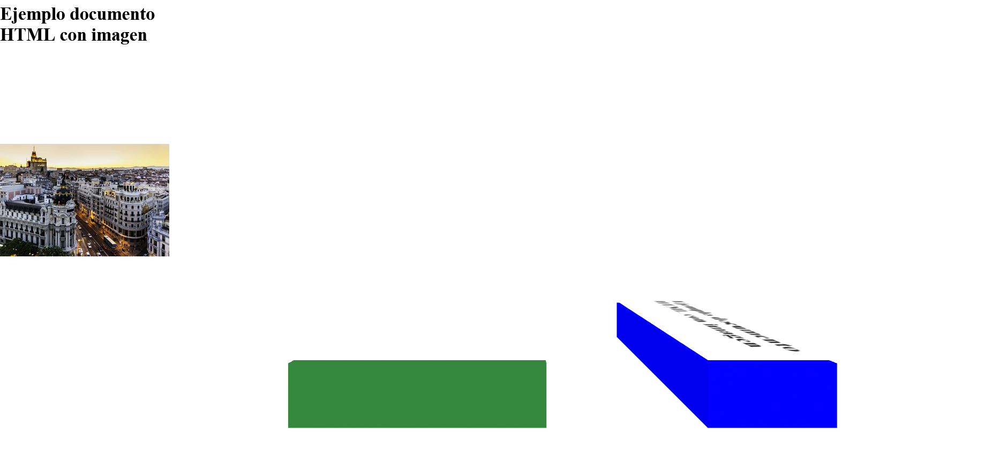
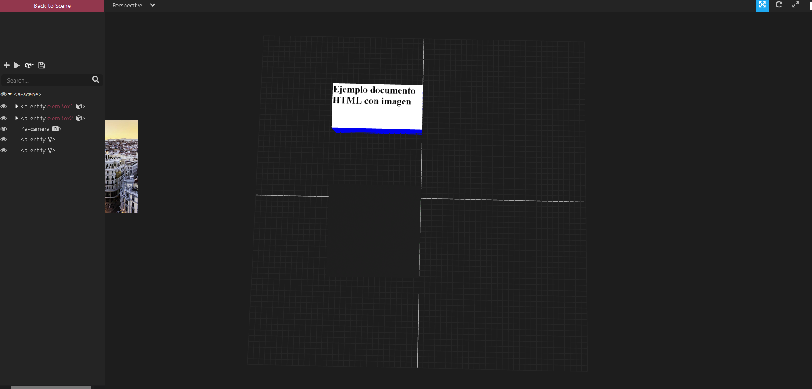

En esta demo se prueba la renderización de los elementos de un documento HTML incluyendo una imagen. 
El Body del HTML de prueba es el siguiente: 

```
<div id="elem1">
    <h1>Ejemplo documento HTML con imagen</h1>
</div>
<div >
    
</div>

```

Además, se construye la escena con dos entidades Box y se incluye dos elementos canvas que van a contener la representación de cada uno de los elementos HTML, en uno el elementos h1 y en otro la imagen.

```
<a-scene start>
    <a-assets>
        <canvas id="canvas" ></canvas>
        <canvas id="canvas2" ></canvas>
    </a-assets>
    <a-entity id="elemBox1"
              geometry="primitive: box; width: 4; height: 2; depth: 8"
              position="8 0.5 -4" rotation="0 0 0"
              material="color: blue">
    </a-entity>
    <a-entity id="elemBox2"
              geometry="primitive: box; width: 8; height: 2; depth: 8"
              position="-3 0.5 -4" rotation="0 0 0"
              material="color: #2E7736">
    </a-entity>

    <a-camera wasd-controls position="0 5.5 9"></a-camera>

</a-scene>

```


Para la renderización de cada elemento HTML, usamos la librería html2canvas, que lo que hace es leer el DOM y construir una representacion del mismo en un ´
elemento canvas existente. 

```
// Canvas para el elemento h1
let elemH1 = document.getElementById("elem1");
let canv = document.getElementById("canvas");
html2canvas(elemH1, {canvas:canv, logging:true});

// Canvas para el elemento img
let elemimg = document.getElementById("imagenMad");
let canv2 = document.getElementById("canvas2");
html2canvas(elemimg, {canvas:canv2, logging:true, letterRendering: 1,allowTaint: true, useCORS: true});


```

Luego creo un plano situado en la cara superior de la caja y le añado como material el canvas correspondiente: 

```
entidadPlane.setAttribute("material", "src:#canvas");
entidadPlane2.setAttribute("material", "src:#canvas2");

```

EL resultado sería el siguiente: 



Visto desde ek Inspector: 



Como se observa, en esta priemra prueba no se carga correctamente la imagen contenida en el canvas con id=canvas2 en el primer plano. 


